# Vibration-Measurement-of-Any-Surfaces-by-Using-Optical-Fiber-System

## Introduction
- The measurement of vibrations is a crucial topic. Some vibrations are necessary for the proper operation of devices (e.g., shakers, ultrasonic cleaning baths, rock drills), while others are merely undesirable side effects of manufacturing tolerances or the structure's response to external forces. As a result, we looked into the literature and found that there are a variety of methods for detecting the frequency and amplitude of vibrations using mechanical, electrical, and optical sensors [1, 4]. Regardless of the operating principle, these systems can be divided into two groups depending on whether physical contact with the vibrating item is required. As a result, we chose the option that does not require physical contact with the vibrating item.
## SolidWorks
- In order to illustrate our design in real world, we have been used SolidWorks to visualize the real system. The used components in the system, IR (Infrared Led), Op-Amp, concave lens, fiber optic cable, mirror, photodiode (BPW41N) and ESP32. The software used for the system, Matlab, Arduino IDE, Proteus 8 Professional, Spyder(anoconda3) and SolidWorks2021
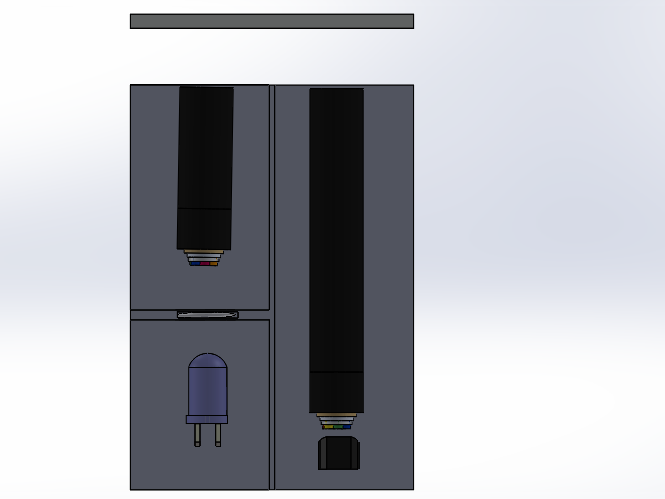
- We collected the dispersed IR Led with the help of thin-sided lens, our light source from infrared led. We collect our led light with the fiber optic cable that we place at the focal point of our thin-sided lens. Our light, which we carry with a fiber optic cable, is transmitted to the mirror. It is transmitted to our other fiber optic cable with the vibration angle of the mirror. The output of this fiber optic cable falls on our photo diode. Thus, we take measurements depending on the amount of light falling on our photodiode.
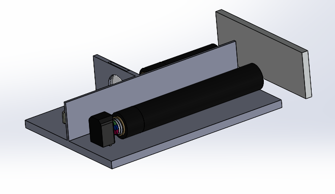
- It is the d1 length between our IR Led and our Lens. Here, we detect the rays emitted to the environment so that they come onto our Lens. With the thin-edged lens, the rays that will come out of our lens are transferred to our fiber optic cable when they come to the d2 focal point. Our light coming out of our fiber optic cable hits our mirror in the distance d3 and is refracted depending on the amount of vibration and comes to our other fiber optic cable. Our light, which we receive with our other fiber cable in the distance d4, drops a certain amount of light on the photodiode at a distance of d5. Thus, in line with the results from our equations, we measure the amount of vibration in the system as a result of the voltages created by the falling light on our photodiode.
## Circuit
- Small signal amplifier is designed for this task. Current generated by photodiode is fed into base of bjt and bjt operates as an amplifier. Output of BJT is then gets read by ESP32.
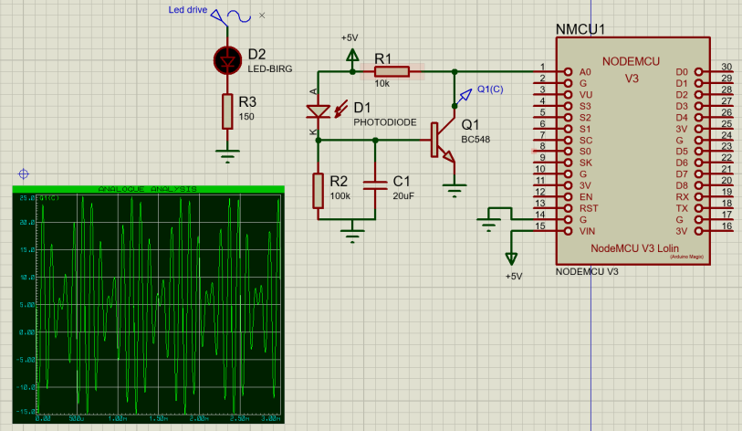
- Proteus is not able to simulate photodiodes. So a sinusoidal current source is used for each electrical component. 
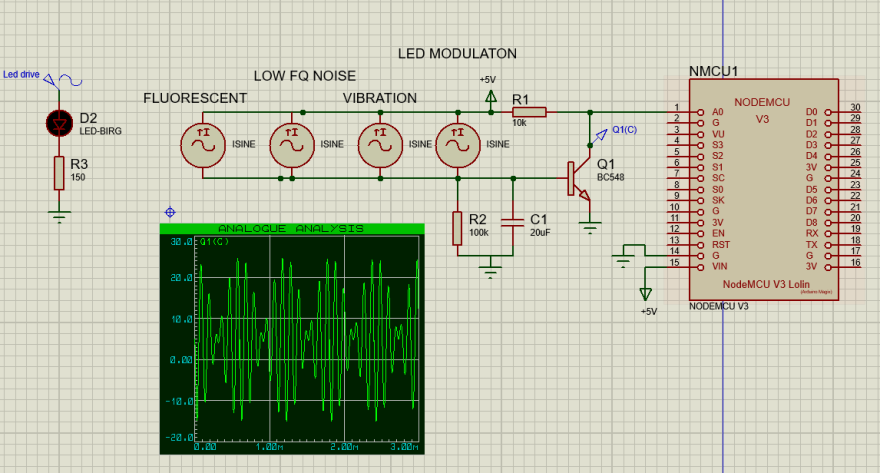
## Spyder (Python)
- All matrix multiplication has been done in Spyder by using Python3. The purpose of using this program is to enhance our ability to work a wide range in software.
## Proteus 8 Professional
- The electrical circuit model was built in order to implement the exact real-life scenario. Hence, the infrared (IR) LED was used to have more consistent and least confliction with other light waves in the experimental environment. The circuit simulate the capturing light by using photodiode, in this circuit. The light was directed to photodiode without any component but the project was aimed to move the light from the source and reflected from the vibrated surface with the help of optical fiber, then the reflected light delivered to photodiode. While capturing the data by the photodiode, the necessary parameters can be found and implemented into real world application.
## Arduino
- When we get the output from the circuit, we need to analyze the data and comment about the frequency as well as amplitude. Thus, the output of the circuit is implemented into Arduino as an analog input and then transfer the data into Matlab throughout Rx and Tx communication protocol. Code:
void setup() {
Serial.begin(115200);
}
void loop() {
float recieved_signal = analogRead(A0)*5/1023;
Serial.println(recieved_signal);
}
## MATLAB 2021b
- While getting our data from Arduino, we need to apply some methods to get meaning of the data.Data recieved is a vector array which includes numerical voltages starting from zero to N number of index.  We applied FFT (Fast Fourier Transform) to recieved vector array to separate all the signals which are acquiring from the surface. And then, we will have several spectral components so that the frequency of the surface could be obtained. Due to constaints of our physical model, we are only be able to define our own signal and process it for simulation. Amplitudes of ac components of the signals are given randomly.
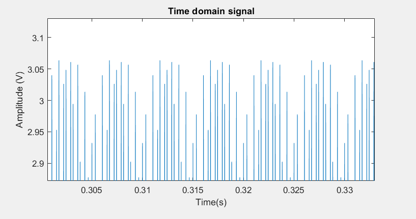
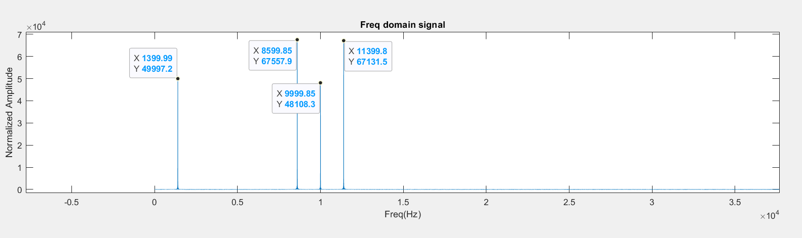
## Mathematical Background
- We used a simple construction in Fig. 9 to get the result of the vibration frequency of the surface, which is the mathematical foundation of this project. In this scenario, the fiber optic specifications play an important part in transporting data from one location to another without losing any data.
- The optic fibers typically have a 0.98-mm core made of Poly-Methyl-Methacrylate (PMMA) [3] and surrounded by a thin (about 20-m) fluorinated polymer cladding (which is much larger than the 9-m core of glass single mode fibers used for high-performance optical communications and the 62.5-m core of multimode glass fibers). As a result, the Ray Optics computation is basically depicted below.
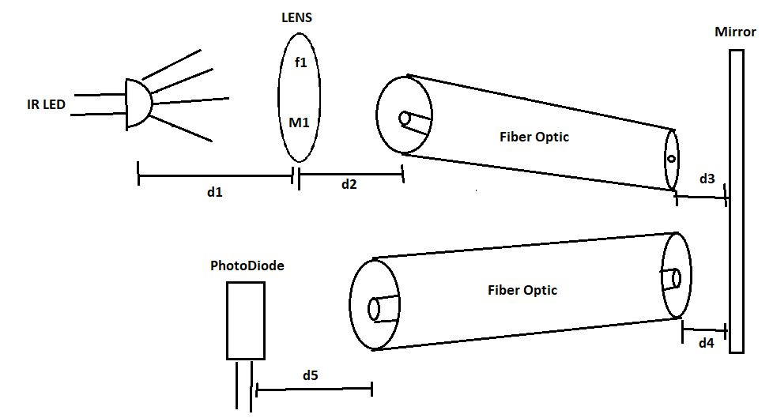
### [Video Demo For an intuition!](https://www.youtube.com/watch?v=JxWaZ8a8mq8)
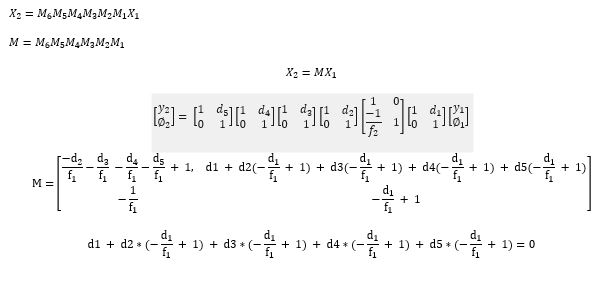
- When this equation equals to 0, we would have gotten clear data output from photodiode. 
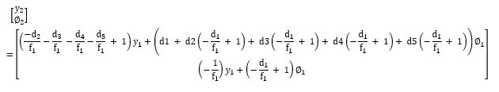
- The solution that will be provided in this project is based on spectral analysis of the received signal when the incoming light is modulated sinusoidally.
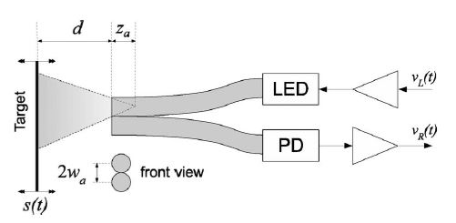
* D_0:  Mean value of target distance
* d = Target distance between fiber tips
* w_a: Radius of plastic optical fiber
* z_a: Position of the light asymptotic cone vertex
- By using Reflectivity compensation technique, the calculations could be done as show below. The sinusoidal modulation of the incident light;
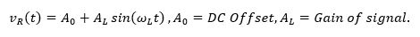
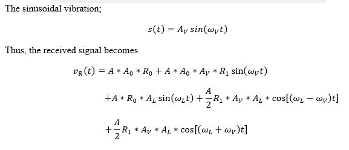
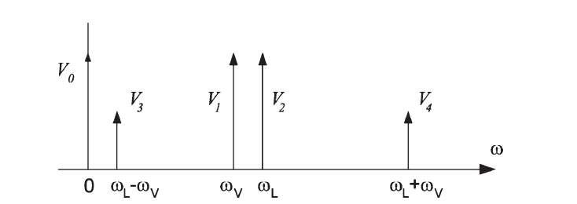
- In this case, the target behaves like a mixer for the optical beams; therefore, the received signal has five spectral components, as shown in Fig. 11, each depending on the unknown term A. Thus, to determine the amplitude of the vibration Av independently from A, in principle, it is sufficient to consider the ratio of any term containing AV with a term not containing AV; however, from a practical point of view and to also compensate the amplitude fluctuations of the LED emissions, there are only two possible solutions:
- The ratio of the component V2 and the component at the LED signal frequency V3 yields the vibration amplitude. This method exclusively uses ac components, which eliminates the dc term's disruptions. Furthermore, using a high LED modulation frequency allows the beat signal V3 (i.e., the component proportional to the vibration amplitude) to be moved further away from the mains signal disruptions, improving overall accuracy. Furthermore, by selecting an LED modulation frequency that is close to that of the vibrating target, it is possible to exploit the mixing effect while measuring high-frequency vibrations and shift down the beat signal to a frequency low enough to be monitored with low-performance equipment. This approach can also be used to measure nonsinusoidal vibrations converted to low frequencies, despite some limits in the vibration bandwidth [7].
- The amplitude of the vibration signal can be derived using the only ac components approach by measuring the amplitude of the components V3 and V2 at the beat frequency L v and the LED stimulus frequency L, respectively. As a result of,  the vibration amplitude can be calculated as follows.
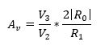
- The spectral component ratio compensates for possible time fluctuations in target reflectivity or amplifier gains, whilst the R0/R1 ratio works as a scaling factor that can be calculated analytically from fiber properties and target distance using the theoretical model.
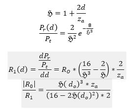
- The distance za was evaluated from the optical power curve, obtaining Za = 1.75 mm. Then, this value was employed to derive the scale factor R01.
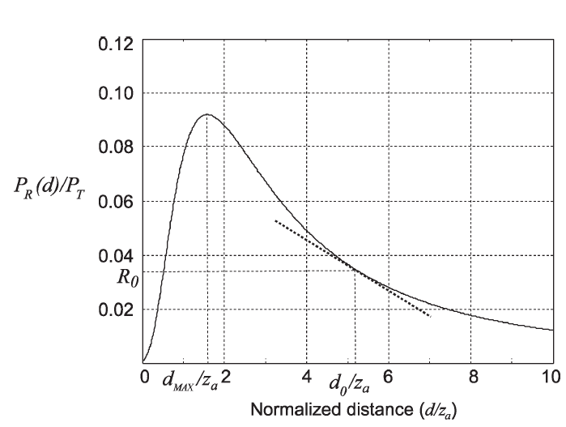
## Conclusion
- In conclusion, vibration frequencies and amplitudes can be evaluated from using reflectivity compensantion technique by using fiber characteristics and seperating the recieved signal to its frequency components by digital signal processing. By using that technique, we can avoid chain gains captured by photodiode which can not be calculated so easily. We could not perform any physical applications hence we only made simulations by using predetermined data.
### References
* [1] Guido Perrone, Member, IEEE, and Alberto Vallan, “A Low-Cost Optical Sensor for Noncontact Vibration Measurements,” IEEE Transactions on Instrumentation and Measurement, vol. 58, no. 5, May 2009
* [2] R. Dib, Y. Alayli, and P.Wagstaff, “A broadband amplitude-modulated fibre optic vibrometer with nanometric accuracy,” Meas., vol. 35, no. 2, pp. 211–219, Mar. 2004.
* [3] X. Li, K. Nakamura, and S. Ueha, “Reflectivity and illuminating power compensation for optical fibre vibrometer,” Meas. Sci. Technol., vol. 15, no. 9, pp. 1773–1778, Sep. 2004.
* [4] A. Buffa, G. Perrone, and A. Vallan, “A plastic optical fiber sensor for vibration measurements,” in Proc. IEEE IMTC, Vancouver, BC, Canada, May 12–15, 2008, pp. 1387–1391.
* [5] R. Dib, Y. Alayli, and P.Wagstaff, “A broadband amplitude-modulated fibre optic vibrometer with nanometric accuracy,” Meas., vol. 35, no. 2, pp. 211– 219, Mar. 2004.
* [6] X. Li, K. Nakamura, and S. Ueha, “Reflectivity and illuminating power compensation for optical fibre vibrometer,” Meas. Sci. Technol., vol. 15, no. 9, pp. 1773–1778, Sep. 2004.
* [7] L. Schnell, Ed., Technology of Electrical Measurements. Chichester, U.K.: Wiley, 1993.
* [8] Guide to the Expression of Uncertainty in Measurement, Int. Stand. Org., Geneva, Switzerland, Oct. 1993.
* [9] A. Buffa, G. Perrone, and A. Vallan, “A plastic optical fiber sensor for vibration measurements,” in Proc. IEEE IMTC, Vancouver, BC, Canada, May 12–15, 2008, pp. 1387–1391.

